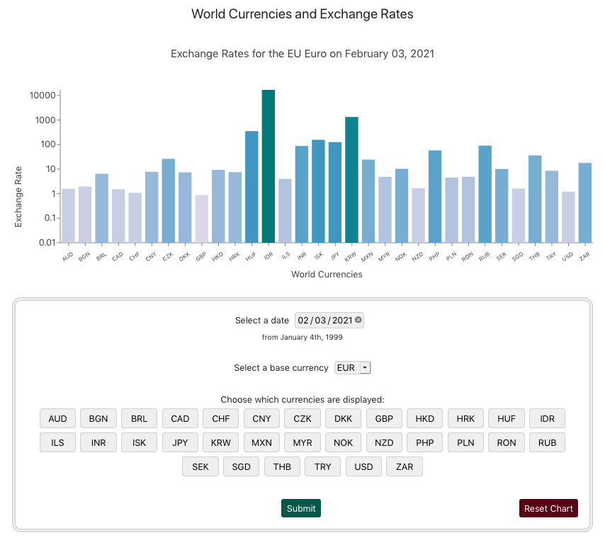
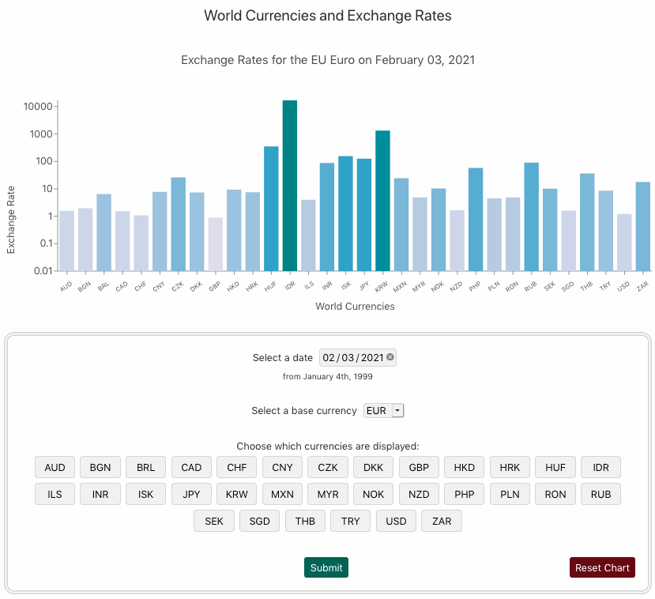

# World Currencies and Exchange Rates

**NOTE: The free API used for this app has been sold to another company. Migration is in progress.**

~~[View the live version on Vercel](https://currency-exchange-rates.vercel.app/)~~

~~This application uses [Rates API](https://ratesapi.io/documentation/) to display current and historical foreign exchange rates.~~  

The display can be customized using the form beneath it. The date, base currency, and currencies displayed in the chart can all be adjusted.  

---

## Technologies Used
- React
- Recharts

---

This project was bootstrapped with [Create React App](https://github.com/facebook/create-react-app).

## Available Scripts

In the project directory, you can run:

### `npm install`
Installs all dependencies.

### `npm start`

Runs the app in the development mode.\
Open [http://localhost:3000](http://localhost:3000) to view it in the browser.

The page will reload if you make edits.\
You will also see any lint errors in the console.
